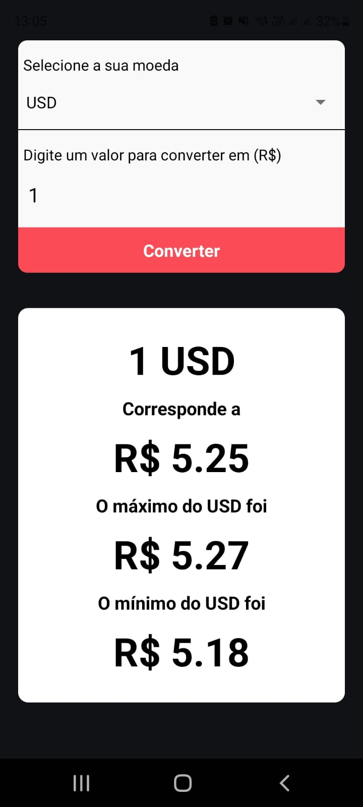

## CONVERSOR DE MOEDAS

<ul>
 <li>O app tem a intenção de mostrar a cotação atual da moeda, o máximo e o mínimo dela em tempo real</li>
 <li>Desenvolvido em React Native, utilizando TypeScript</li>
</ul>

## Configurações

<ul>
<li>O app foi desenvolvido totalmente com o Expo. Link: <a href='https://docs.expo.dev/'>https://docs.expo.dev/</a> </li>
<li>Para a aplicação rodar é necessário realizar o comando: Expo Start</li>
<li>A API utilizada para esse projeto foi a: <a href='https://docs.awesomeapi.com.br/api-de-moedas'>https://docs.awesomeapi.com.br/api-de-moedas</a></li>
<li>As dependencias utilizadas foram: <ul><li>expo install @react-native-picker/picker</li><li>npm install react-native-picker-select</li><li>expo install axios</li><li>Link para a dependência Picker: <a href='https://github.com/lawnstarter/react-native-picker-select'>https://github.com/lawnstarter/react-native-picker-select</a></li><li>Link para a dependência Axios: <a href='https://www.npmjs.com/package/react-native-axios'>https://www.npmjs.com/package/react-native-axios</a></li></ul></li>
</ul>

